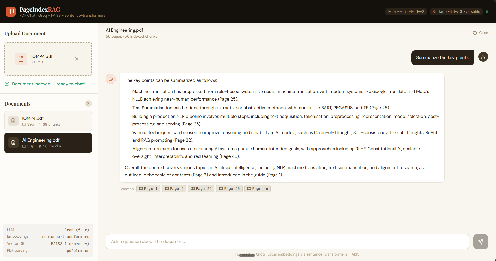

# PageIndexRAG 📄🔍

> **Chat with your PDF documents using 100% free, open-source tools.**  
> Upload a PDF → get it indexed → ask questions → receive page-cited answers in real time.


---

## Table of Contents

1. [What is PageIndexRAG?](#1-what-is-pageindexrag)
2. [Technology Stack — Why Every Tool Was Chosen](#2-technology-stack--why-every-tool-was-chosen)
3. [Architecture Overview](#3-architecture-overview)
4. [RAG Pipeline Explained Step by Step](#4-rag-pipeline-explained-step-by-step)
5. [Project Structure](#5-project-structure)
6. [Prerequisites](#6-prerequisites)
7. [Getting Your Free Groq API Key](#7-getting-your-free-groq-api-key)
8. [Installation & Setup (Step-by-Step)](#8-installation--setup-step-by-step)
9. [Running the Application](#9-running-the-application)
10. [Using the Application](#10-using-the-application)
11. [API Reference](#11-api-reference)
12. [Configuration Reference](#12-configuration-reference)
13. [How Each Component Works Internally](#13-how-each-component-works-internally)
14. [Data Flow Diagrams](#14-data-flow-diagrams)
15. [Troubleshooting](#15-troubleshooting)
16. [Extending the Project](#16-extending-the-project)
17. [Limitations & Known Constraints](#17-limitations--known-constraints)
18. [License](#18-license)

---

## 1. What is PageIndexRAG?

**PageIndexRAG** is a full-stack Retrieval-Augmented Generation (RAG) application that lets you upload any text-based PDF and immediately start asking questions about it in natural language. Answers are grounded strictly in the document content, and every answer includes **page number citations** so you can verify the source.

### Key features

| Feature | Details |
|---|---|
| PDF Upload & Indexing | Drag-and-drop upload, automatic text extraction and chunking |
| Semantic Search | Local sentence-transformer embeddings + FAISS vector search |
| AI Answers | Llama 3 70B via Groq API (free tier, very fast) |
| Streaming Responses | Token-by-token streaming via SSE (Server-Sent Events) |
| Page Citations | Every answer cites which pages the information came from |
| Multi-document | Upload multiple PDFs; switch between them |
| 100% Free | No paid APIs except optional Groq (which has a generous free tier) |

---

## 2. Technology Stack — Why Every Tool Was Chosen

### Backend

| Tool | Version | Role | Why chosen |
|---|---|---|---|
| **Python** | 3.10+ | Runtime | Universal, best ML/AI library support |
| **FastAPI** | 0.111 | Web framework | Async, auto-docs, Pydantic validation |
| **uvicorn** | 0.29 | ASGI server | Production-grade async server |
| **pdfplumber** | 0.11 | PDF parsing | Best text extraction with layout awareness |
| **sentence-transformers** | 2.7 | Local embeddings | Free, runs on CPU, ~80MB model, great quality |
| **FAISS** | 1.8 | Vector search | Facebook's library; blazing fast even on CPU |
| **Groq SDK** | 0.8 | LLM inference | Free API, fastest inference available (Llama 3 70B) |
| **pydantic-settings** | 2.2 | Config management | Type-safe env-var loading |

### Frontend

| Tool | Version | Role | Why chosen |
|---|---|---|---|
| **React** | 18.3 | UI framework | Component model, hooks, ecosystem |
| **Vite** | 5.3 | Build tool | Instant HMR, fast builds |
| **Tailwind CSS** | 3.4 | Styling | Utility-first, no runtime overhead |
| **react-markdown** | 9.0 | Markdown rendering | Render LLM markdown output safely |
| **lucide-react** | 0.383 | Icons | Clean, consistent icon library |

---

## 3. Architecture Overview

```
┌─────────────────────────────────────────────────────────────┐
│                     Browser (React + Vite)                   │
│                                                              │
│  ┌──────────────┐  ┌──────────────────────────────────────┐ │
│  │  Sidebar     │  │  Chat Panel                           │ │
│  │  - Upload    │  │  - Message history                    │ │
│  │  - Doc list  │  │  - Streaming answer                   │ │
│  └──────────────┘  │  - Page citation badges               │ │
│                    └──────────────────────────────────────┘ │
└───────────────────────────┬─────────────────────────────────┘
                            │  HTTP / SSE
                            ▼
┌─────────────────────────────────────────────────────────────┐
│               FastAPI Backend (Python)                        │
│                                                              │
│  POST /api/upload    →  pdf_processor  →  vector_store      │
│  POST /api/chat      →  vector_store   →  llm_client  →SSE  │
│  GET  /api/documents →  document_registry                    │
│  DELETE /api/docs/id →  vector_store cleanup                │
└──────────────┬──────────────────────────────────────────────┘
               │
    ┌──────────┴──────────────────────────────┐
    │                                         │
    ▼                                         ▼
┌─────────────────────┐         ┌────────────────────────────┐
│  FAISS + sentence-  │         │      Groq Cloud API         │
│  transformers       │         │  (Llama 3 70B — free tier)  │
│  (runs locally,     │         │  Streaming inference         │
│   no internet)      │         └────────────────────────────┘
└─────────────────────┘
```

**Data never leaves your machine except for:**
- The retrieved text chunks + your question → sent to Groq for the LLM answer
- PDF content, embeddings, and vector index stay 100% local

---

## 4. RAG Pipeline Explained Step by Step

RAG stands for **Retrieval-Augmented Generation**. Instead of asking an LLM to answer from memory (which causes hallucinations), we first retrieve relevant text from the document and feed it to the LLM as context.

### Phase 1: Indexing (when you upload a PDF)

```
PDF file
   │
   ▼
[pdfplumber] ── extracts text page by page ──► raw text per page
   │
   ▼
[pdf_processor] ── splits text into overlapping chunks ──► List[PageChunk]
   │                  (each chunk: ~500 words, 50-word overlap)
   │                  (each chunk remembers its page number)
   ▼
[sentence-transformers] ── encodes each chunk ──► 384-dim float32 vector
   │                        (model: all-MiniLM-L6-v2)
   ▼
[FAISS IndexFlatIP] ── stores all vectors ──► searchable in-memory index
```

**Why overlapping chunks?**  
If a key sentence sits at the boundary between two chunks, an overlap ensures it appears fully in at least one chunk and is therefore retrievable.

**Why sentence-transformers locally?**  
No API call needed, no cost, no latency. The `all-MiniLM-L6-v2` model produces high-quality semantic embeddings and runs on CPU in milliseconds per batch.

### Phase 2: Retrieval (when you ask a question)

```
User question: "What are the main findings?"
   │
   ▼
[sentence-transformers] ── encode question ──► 384-dim query vector
   │
   ▼
[FAISS] ── cosine similarity search ──► Top-5 most similar chunks
   │         (inner product on normalized vectors = cosine similarity)
   │
   ▼
Ranked list of PageChunks with similarity scores
```

### Phase 3: Generation (answer creation)

```
Top-5 chunks + user question
   │
   ▼
[llm_client.py] ── formats RAG prompt with:
   │                 - System instruction (cite pages, stay grounded)
   │                 - Context blocks labeled [Page N]
   │                 - User question
   ▼
[Groq API] ── Llama 3 70B inference ──► streaming tokens
   │
   ▼
[FastAPI SSE] ── streams tokens to browser
   │
   ▼
React frontend assembles tokens in real time
   + extracts page citations from final sources payload
```

### Why this is better than just asking the LLM

| Without RAG | With RAG |
|---|---|
| LLM guesses from training data | LLM uses your actual document |
| Hallucinations common | Answers grounded in real text |
| No source citations | Page numbers cited |
| Works only on public/known docs | Works on any private document |

---

## 5. Project Structure

```
pageindexrag/
│
├── backend/                    # Python FastAPI server
│   ├── main.py                 # FastAPI app, all endpoints
│   ├── config.py               # Pydantic settings from .env
│   ├── pdf_processor.py        # PDF text extraction + chunking
│   ├── vector_store.py         # FAISS index + embedding management
│   ├── llm_client.py           # Groq API client + prompt builder
│   ├── requirements.txt        # Python dependencies
│   └── .env.example            # Template for environment variables
│
├── frontend/                   # React + Vite SPA
│   ├── index.html              # HTML entry point (loads Google Fonts)
│   ├── vite.config.js          # Vite config + /api proxy to :8000
│   ├── tailwind.config.js      # Custom design tokens
│   ├── postcss.config.js       # PostCSS for Tailwind
│   ├── package.json            # Node dependencies + scripts
│   └── src/
│       ├── main.jsx            # React root mount
│       ├── App.jsx             # Root component, layout, health check
│       ├── index.css           # Tailwind base + custom styles
│       ├── components/
│       │   ├── UploadPanel.jsx    # Drag-drop upload + progress
│       │   ├── DocumentList.jsx   # Sidebar doc list + delete
│       │   ├── ChatPanel.jsx      # Full chat UI + suggested questions
│       │   └── ChatMessage.jsx    # Single message + source badges
│       └── utils/
│           └── api.js             # All API calls + SSE streaming
│
├── data/                       # (empty) Reserved for future persistence
├── start_backend.sh            # Linux/Mac: setup + start backend
├── start_frontend.sh           # Linux/Mac: setup + start frontend
├── start_backend.bat           # Windows: setup + start backend
├── start_frontend.bat          # Windows: setup + start frontend
├── .gitignore
└── README.md
```

---

## 6. Prerequisites

### Required

| Software | Minimum Version | How to check | Download |
|---|---|---|---|
| Python | 3.10 | `python3 --version` | https://python.org |
| Node.js | 18.0 | `node --version` | https://nodejs.org |
| npm | 9.0 | `npm --version` | (comes with Node.js) |

### Optional but recommended

- **Git** — for cloning; otherwise download the ZIP
- **A modern browser** — Chrome 90+, Firefox 90+, Edge 90+

### System Requirements

- **RAM**: 2 GB minimum (sentence-transformer model loads ~300 MB)
- **Disk**: ~500 MB for Python packages + Node modules
- **CPU**: Any modern CPU; no GPU required
- **Internet**: Only for Groq API calls during chat (indexing is offline)

---

## 7. Getting Your Free Groq API Key

Groq provides **free API access** to Llama 3 and Mixtral models with generous rate limits.

1. Go to **https://console.groq.com**
2. Sign up with your email (or Google/GitHub)
3. Navigate to **API Keys** in the left sidebar
4. Click **Create API Key**
5. Give it a name (e.g. `pageindexrag`)
6. **Copy the key** — it starts with `gsk_...`
7. Paste it into `backend/.env` as `GROQ_API_KEY=gsk_...`

**Free tier limits** (as of 2024):
- Llama 3 70B: 14,400 requests/day, 6,000 tokens/minute
- More than enough for personal use

**Available models** (set in `.env` as `GROQ_MODEL`):
- `llama3-70b-8192` — Best quality, default ✅
- `llama3-8b-8192` — Faster, lighter
- `mixtral-8x7b-32768` — Larger context window
- `gemma-7b-it` — Google's Gemma

---

## 8. Installation & Setup (Step-by-Step)

### Step 1: Get the project files

**Option A — Download ZIP** (no Git needed):
1. Download and extract the ZIP file
2. Open a terminal in the extracted `pageindexrag/` folder

**Option B — Git clone**:
```bash
git clone <repo-url>
cd pageindexrag
```

### Step 2: Configure environment variables

```bash
cd backend
cp .env.example .env
```

Open `backend/.env` in any text editor and fill in:

```env
GROQ_API_KEY=gsk_your_actual_key_here
GROQ_MODEL=llama3-70b-8192
EMBED_MODEL=all-MiniLM-L6-v2
CHUNK_SIZE=500
CHUNK_OVERLAP=50
TOP_K=5
MAX_FILE_SIZE_MB=50
CORS_ORIGINS=http://localhost:5173,http://localhost:3000
```

Save the file. Go back to the project root:
```bash
cd ..
```

### Step 3: Set up the Python backend

**Linux / macOS:**
```bash
cd backend
python3 -m venv venv
source venv/bin/activate
pip install --upgrade pip
pip install -r requirements.txt
```

**Windows (PowerShell):**
```powershell
cd backend
python -m venv venv
venv\Scripts\Activate.ps1
pip install --upgrade pip
pip install -r requirements.txt
```

> ⚠️ The first install downloads sentence-transformers and PyTorch (~500 MB). This is a one-time download.

### Step 4: Set up the Node.js frontend

Open a **second terminal** (keep the backend terminal open):

```bash
cd frontend
npm install
```

This installs React, Vite, Tailwind, and other dependencies into `node_modules/`.

---

## 9. Running the Application

You need **two terminals running simultaneously**.

### Terminal 1 — Backend

```bash
# Linux/Mac
cd pageindexrag/backend
source venv/bin/activate
uvicorn main:app --host 0.0.0.0 --port 8000 --reload

# Windows
cd pageindexrag\backend
venv\Scripts\activate
uvicorn main:app --host 0.0.0.0 --port 8000 --reload
```

You should see:
```
INFO:     Uvicorn running on http://0.0.0.0:8000
[VectorStoreManager] Loading embedding model: all-MiniLM-L6-v2
[VectorStoreManager] Embedding model ready.
[Startup] PageIndexRAG backend ready.
```

The **first run downloads the embedding model** (~80 MB) from HuggingFace. Subsequent starts use the cache.

### Terminal 2 — Frontend

```bash
cd pageindexrag/frontend
npm run dev
```

You should see:
```
  VITE v5.x.x  ready in 300ms

  ➜  Local:   http://localhost:5173/
```

### Or use the convenience scripts

```bash
# Linux/Mac — Terminal 1
./start_backend.sh

# Linux/Mac — Terminal 2
./start_frontend.sh

# Windows — double-click or run:
start_backend.bat   # Terminal 1
start_frontend.bat  # Terminal 2
```

### Open the app

Navigate to **http://localhost:5173** in your browser.

---

## 10. Using the Application

### Uploading a PDF

1. In the left sidebar, click the **drop zone** or drag a PDF onto it
2. The filename and size appear with a preview
3. Click **Index PDF** 
4. A progress bar shows upload progress
5. After a few seconds, the document appears in the **Documents** list
6. The document is automatically selected and the chat panel activates

### Asking Questions

1. Select a document from the sidebar (highlighted in dark)
2. The chat panel shows **suggested questions** to get started
3. Type your question in the input box
4. Press **Enter** or click the **Send** button
5. Watch the answer stream in token by token
6. **Source badges** appear below each answer (e.g. `📖 Page 3`)
7. **Hover over a source badge** to preview the exact excerpt from that page

### Managing Documents

- **Switch documents**: Click any document in the sidebar — the chat history updates
- **Delete a document**: Hover over a document and click the trash icon
- **Clear chat**: Click "Clear" in the top-right of the chat panel
- **Multiple documents**: Upload as many as you like; each has its own isolated index

### Tips for Best Results

- **Text-based PDFs work best** — Scanned/image PDFs have no extractable text
- **Specific questions get specific answers** — "What percentage did revenue grow?" is better than "Tell me everything"
- **Ask for summaries** — "Summarize the key findings" works well
- **Follow-up questions** — Each question is independent (no conversation memory across questions to the same document); be explicit about what you're asking

---

## 11. API Reference

The backend auto-generates interactive API docs at **http://localhost:8000/docs**

### POST `/api/upload`

Upload and index a PDF.

**Request**: `multipart/form-data` with field `file` (PDF)

**Response** `200 OK`:
```json
{
  "doc_id": "uuid-string",
  "filename": "my-document.pdf",
  "total_pages": 42,
  "total_chunks": 187,
  "metadata": {
    "total_pages": 42,
    "title": "Annual Report 2024",
    "author": "Jane Smith",
    "subject": "",
    "creator": "Microsoft Word"
  }
}
```

**Errors**:
- `400` — Not a PDF file
- `413` — File exceeds MAX_FILE_SIZE_MB
- `422` — PDF has no extractable text (image-only)

---

### POST `/api/chat`

Ask a question about an indexed document. Returns a **Server-Sent Events** stream.

**Request body**:
```json
{
  "doc_id": "uuid-string",
  "question": "What are the main conclusions?",
  "stream": true
}
```

**SSE Event types**:

```
data: {"type": "token", "content": "The"}
data: {"type": "token", "content": " main"}
data: {"type": "token", "content": " conclusion"}
...
data: {"type": "sources", "sources": [
  {"page": 3, "score": 0.8821, "excerpt": "The study concludes..."},
  {"page": 7, "score": 0.7934, "excerpt": "In summary..."}
]}
data: {"type": "done"}
```

**Error event**:
```
data: {"type": "error", "message": "GROQ_API_KEY not configured"}
```

---

### GET `/api/documents`

List all indexed documents.

**Response**:
```json
{
  "documents": [
    {
      "doc_id": "uuid",
      "filename": "report.pdf",
      "total_pages": 15,
      "total_chunks": 67,
      "metadata": {...}
    }
  ],
  "total": 1
}
```

---

### DELETE `/api/documents/{doc_id}`

Remove a document and its vector index from memory.

**Response**:
```json
{"message": "Document deleted successfully.", "doc_id": "uuid"}
```

---

### GET `/api/health`

Check backend status and configuration.

**Response**:
```json
{
  "status": "ok",
  "groq_model": "llama3-70b-8192",
  "embed_model": "all-MiniLM-L6-v2",
  "indexed_docs": 2
}
```

---

## 12. Configuration Reference

All settings live in `backend/.env`:

| Variable | Default | Description |
|---|---|---|
| `GROQ_API_KEY` | *(required)* | Your Groq API key from console.groq.com |
| `GROQ_MODEL` | `llama3-70b-8192` | Groq model for answer generation |
| `EMBED_MODEL` | `all-MiniLM-L6-v2` | HuggingFace sentence-transformer model |
| `CHUNK_SIZE` | `500` | Max words per text chunk |
| `CHUNK_OVERLAP` | `50` | Overlap words between adjacent chunks |
| `TOP_K` | `5` | Number of chunks retrieved per question |
| `MAX_FILE_SIZE_MB` | `50` | Maximum PDF upload size |
| `CORS_ORIGINS` | `http://localhost:5173,...` | Comma-separated allowed origins |

### Tuning Tips

**Better recall (finds more relevant content)**:
- Increase `TOP_K` to 7–10
- Decrease `CHUNK_SIZE` to 300 (smaller, more precise chunks)

**Faster processing / less memory**:
- Decrease `CHUNK_SIZE` to 300
- Use `GROQ_MODEL=llama3-8b-8192` (smaller, faster model)

**For very long documents (100+ pages)**:
- Increase `CHUNK_OVERLAP` to 80–100
- Keep `CHUNK_SIZE` at 500

---

## 13. How Each Component Works Internally

### `pdf_processor.py`

1. Receives PDF bytes in memory (never written to disk)
2. Opens with `pdfplumber` which parses the PDF binary format
3. Iterates pages; calls `page.extract_text()` for each
4. Cleans text: removes excess whitespace, normalises newlines
5. Splits each page's text into word-based chunks with configurable overlap
6. Returns `List[PageChunk]` — each chunk knows its `page_number`, `doc_id`, and a unique `chunk_id`

**Why pdfplumber over PyPDF2?**  
pdfplumber handles multi-column layouts, tables, and complex PDFs far better. It uses pdfminer under the hood for robust text positioning.

### `vector_store.py`

**`VectorStoreManager`** (singleton):
- Loads the sentence-transformer model **once** at startup
- Holds a `dict[doc_id → DocumentVectorStore]`

**`DocumentVectorStore`** (per document):
- Calls `model.encode(texts, normalize_embeddings=True)` to get float32 arrays
- Normalization ensures cosine similarity = inner product (efficient with FAISS `IndexFlatIP`)
- Builds a FAISS flat index — no approximation, exact nearest-neighbour search
- On query: encodes query, runs `index.search(vec, k)`, returns ranked `SearchResult` list

**Why FAISS over ChromaDB / Pinecone / Qdrant?**  
FAISS is a C++ library with Python bindings — zero external dependencies, runs entirely in process, no Docker, no server, no network, free forever. For document sizes up to ~10,000 pages (millions of chunks), FAISS flat search is fast enough.

### `llm_client.py`

**Prompt engineering**:
```
System: "You are PageIndexRAG... cite pages... stay grounded..."
User:   "[Page 3]\n<chunk text>\n\n---\n\n[Page 7]\n<chunk text>\n\nUSER QUESTION: ..."
```

The model sees context labeled by page number, which causes it to naturally include `(Page N)` citations in its answer.

**Streaming**: Uses `stream=True` in the Groq SDK which returns an `AsyncIterator`. FastAPI's `StreamingResponse` wraps this in SSE format.

**Temperature 0.2**: Low temperature for factual, grounded answers. Higher values make answers more creative/varied but less reliable.

### `main.py`

**Upload flow**:
1. Validate file type and size
2. Read bytes into memory
3. Generate a UUID for the document
4. `pdf_processor.extract_chunks()` → chunks
5. `vector_manager.index_document()` → FAISS index built
6. Store metadata in `document_registry` dict
7. Return `DocumentInfo` response

**Chat flow**:
1. Validate `doc_id` exists
2. `vector_manager.search()` → top-K chunks
3. Stream `llm_client.answer_stream()` → SSE tokens
4. After all tokens: send `sources` event, then `done` event

---

## 14. Data Flow Diagrams

### Upload Flow

```
Browser                    FastAPI                pdf_processor      vector_store
   │                          │                        │                   │
   │── POST /api/upload ──────►│                        │                   │
   │   (multipart PDF)         │── extract_chunks() ───►│                   │
   │                          │   (bytes, doc_id)       │                   │
   │                          │                        │                   │
   │                          │◄── List[PageChunk] ────│                   │
   │                          │                        │                   │
   │                          │── index_document() ─────────────────────►│
   │                          │   (doc_id, chunks)                         │
   │                          │                                            │
   │                          │                           build FAISS index│
   │                          │◄─────────────────── total_chunks ──────────│
   │                          │                                            │
   │◄── DocumentInfo ─────────│                                            │
   │    (doc_id, pages, etc.)  │                                            │
```

### Chat Flow

```
Browser         FastAPI        vector_store    Groq API
   │               │               │              │
   │─POST /chat───►│               │              │
   │  {doc_id, q}  │               │              │
   │               │──search() ───►│              │
   │               │   (q, top_k)  │              │
   │               │◄──results ────│              │
   │               │               │              │
   │               │─────── POST /chat (prompt+context) ──►│
   │               │                                        │
   │◄─ SSE token ──│◄─────────────── stream tokens ─────────│
   │◄─ SSE token ──│                                        │
   │◄─ SSE token ──│                                        │
   │               │◄─────────────── [done] ────────────────│
   │◄─ SSE sources─│               │              │
   │◄─ SSE done ───│               │              │
```

---

## 15. Troubleshooting

### Backend won't start

**`ModuleNotFoundError: No module named 'faiss'`**
```bash
pip install faiss-cpu
```

**`ModuleNotFoundError: No module named 'pdfplumber'`**
```bash
pip install -r requirements.txt
```

**Port 8000 already in use**
```bash
# Find the process
lsof -i :8000   # Mac/Linux
netstat -ano | findstr :8000   # Windows

# Kill it or use a different port:
uvicorn main:app --port 8001
# Then update CORS_ORIGINS in .env and vite.config.js proxy target
```

---

### Frontend won't start

**`npm: command not found`**  
Install Node.js from https://nodejs.org (LTS version)

**Port 5173 in use**  
Edit `vite.config.js` and change `port: 5173` to another port.

---

### Upload errors

**"No text could be extracted from this PDF"**  
The PDF is image-only (scanned document). You need OCR preprocessing. Tools: `ocrmypdf`, Adobe Acrobat, or online OCR services. Once OCR'd, re-export as a text-based PDF.

**"File too large"**  
Increase `MAX_FILE_SIZE_MB` in `.env`. Note: larger files = more memory used.

---

### Chat errors

**"GROQ_API_KEY is not configured"**  
Open `backend/.env` and add your key: `GROQ_API_KEY=gsk_...`

**"Rate limit exceeded" from Groq**  
You've hit the free tier rate limit. Wait 1 minute and try again. Or switch to a smaller model: `GROQ_MODEL=llama3-8b-8192`

**Answer is "I could not find sufficient information..."**  
The relevant content wasn't in the top-K retrieved chunks. Try:
- Rephrasing the question with more specific terms
- Increasing `TOP_K` to 8–10 in `.env`
- Decreasing `CHUNK_SIZE` to 300 for more granular retrieval

---

### Slow first startup

Normal — the sentence-transformer model (~80 MB) downloads from HuggingFace on first run. Subsequent starts use the local cache at `~/.cache/huggingface/`.

---

### CORS errors in browser console

Ensure `CORS_ORIGINS` in `.env` includes your frontend URL exactly:
```env
CORS_ORIGINS=http://localhost:5173
```
Restart the backend after changing `.env`.

---

## 16. Extending the Project

### Add OCR support for scanned PDFs

```bash
pip install ocrmypdf pytesseract
```

In `pdf_processor.py`, add a fallback OCR step when `page.extract_text()` returns empty.

### Add conversation memory

Modify `ChatPanel.jsx` to send the last N message pairs and update `/api/chat` to accept `history: List[{role, content}]`. Pass history to Groq as the messages array.

### Persist the vector index to disk

In `vector_store.py`:
```python
faiss.write_index(self.index, f"data/{doc_id}.faiss")
# Load on restart:
self.index = faiss.read_index(f"data/{doc_id}.faiss")
```
Also serialize `self.chunks` with `pickle` or `json`.

### Add a better embedding model

Replace `EMBED_MODEL` in `.env`:
- `BAAI/bge-large-en-v1.5` — Higher quality, larger (1.3 GB)
- `thenlper/gte-base` — Good quality, similar size
- `intfloat/e5-large-v2` — Excellent for Q&A tasks

### Swap the vector store for ChromaDB

For persistence without manual serialization:
```bash
pip install chromadb
```
ChromaDB stores vectors on disk automatically and supports filtering.

### Add a reranker for better precision

After FAISS retrieval, add a cross-encoder reranker:
```bash
pip install sentence-transformers  # already installed
```
```python
from sentence_transformers import CrossEncoder
reranker = CrossEncoder('cross-encoder/ms-marco-MiniLM-L-6-v2')
scores = reranker.predict([(query, chunk.text) for chunk in results])
```

### Deploy to a server

**Backend**: Use `gunicorn` with `uvicorn` workers:
```bash
pip install gunicorn
gunicorn main:app -w 2 -k uvicorn.workers.UvicornWorker --bind 0.0.0.0:8000
```

**Frontend**: Build static files:
```bash
cd frontend
npm run build
# Serve dist/ with nginx or any static host
```

---

## 17. Limitations & Known Constraints

| Limitation | Details | Workaround |
|---|---|---|
| Image-only PDFs | No text extraction from scanned docs | Run OCR first with ocrmypdf |
| In-memory only | Documents lost on server restart | Add FAISS disk persistence |
| No conversation memory | Each question is independent | Add history to prompt |
| No authentication | Anyone with access can upload/delete | Add FastAPI auth middleware |
| Single server | No horizontal scaling | Use Redis for shared state |
| English-optimised | Embedding model works best in English | Use multilingual model |
| Groq rate limits | 6000 tokens/minute on free tier | Wait or upgrade to paid tier |
| Large file memory | 100-page PDF ≈ 20 MB RAM for embeddings | Add chunk-level lazy loading |

---

## 18. License

This project is released under the **MIT License** — free to use, modify, and distribute for personal and commercial purposes.

All open-source dependencies retain their own licenses:
- **sentence-transformers**: Apache 2.0
- **FAISS**: MIT
- **FastAPI**: MIT
- **pdfplumber**: MIT
- **React**: MIT
- **Groq SDK**: Apache 2.0
- **Llama 3** (via Groq): Meta Llama 3 Community License

---

## Quick Reference Card

```
# 1. Get Groq API key
https://console.groq.com → API Keys → Create

# 2. Configure
cp backend/.env.example backend/.env
# Edit backend/.env, set GROQ_API_KEY=gsk_...

# 3. Backend (Terminal 1)
cd backend && python3 -m venv venv && source venv/bin/activate
pip install -r requirements.txt
uvicorn main:app --port 8000 --reload

# 4. Frontend (Terminal 2)
cd frontend && npm install && npm run dev

# 5. Open browser
http://localhost:5173
```

---

*Built with ❤️ using open-source tools. Zero paid dependencies required (Groq free tier included).*
